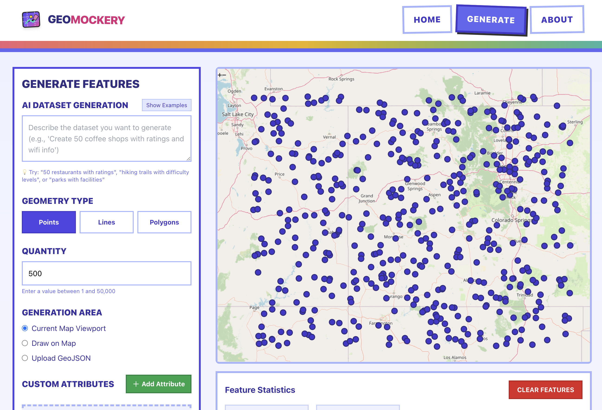

# 🗺️ **GEOMOCKERY**

> *"Why wait for real data when you can generate better fake data?"*



**Geomockery** is the AI-powered geospatial data generator that solves the eternal developer problem: *"I need realistic location data... but I can't use the real stuff."* 

Built with modern web technologies and a brutalist design philosophy, Geomockery transforms the tedious process of creating test data into a fun, creative experience.

---

## 🎯 **About: Filling the Void in Geospatial Development**

Every geospatial developer has been there:

- 🚧 **The real data isn't ready yet** (and it never will be on time)
- 🔒 **Privacy concerns** make real data off-limits for development
- 📊 **Production data is too sensitive** to use in testing environments
- 🎲 **You need specific edge cases** that don't exist in real datasets
- 🏗️ **Client data is under NDA** but you still need to build the app

**Traditional solutions suck:**
- Generic placeholder data that doesn't reflect real-world complexity
- Manually crafting test datasets (soul-crushing and time-consuming)
- Using oversimplified geometric shapes that miss spatial relationships
- CSV files with lat/lon columns that bear no resemblance to actual use cases

**Geomockery changes the game** by generating contextually-aware, realistic geospatial features that actually make sense together. Need 500 coffee shops distributed realistically across downtown? Done. Want delivery routes that follow actual street patterns? Easy. Need census tract polygons with correlated demographic attributes? You got it.

### **Why We Built This**

The geospatial development ecosystem has amazing tools for *working* with location data, but creating realistic test data remained a massive pain point. We wanted to remove that friction entirely and make data generation as creative and intuitive as the apps we're building.

Geomockery fills this gap with:
- **Smart spatial distribution** that mimics real-world patterns
- **AI-powered attribute generation** that creates meaningful relationships
- **Privacy-safe development** with zero real-world data exposure
- **Export flexibility** that works with your existing GIS workflow

---

## ⚡ **Features That Actually Matter**

### 🎨 **Creative Data Generation**
- **Points, Lines & Polygons**: Generate any geometry type with intelligent spatial relationships
- **AI-Powered Attributes**: Custom schemas with contextually relevant values
- **Natural Distribution**: Realistic clustering and spacing that mimics real data
- **Interactive Drawing**: Define boundaries by sketching directly on the map

### 🛠️ **Developer-Friendly Workflow**
- **Multiple Export Formats**: GeoJSON, Shapefile, GeoPackage - whatever your stack needs
- **Boundary Flexibility**: Use map viewport, custom drawn areas, or upload existing GeoJSON
- **Attribute Customization**: Nominal, ordinal, quantitative, temporal, and identifier types
- **Instant Preview**: See your data before you download it

### 🚀 **Performance & Scale**
- **Client-Side Generation**: No server dependency, works offline
- **Scalable Output**: Generate 1 to 50,000+ features efficiently
- **Modern Architecture**: Built with Next.js 15, React 19, and professional project structure

---

## 🎮 **Getting Started (It's Actually Fun)**

```bash
# Clone this beauty
git clone https://github.com/yourusername/geomockery.git

# Jump in
cd geomockery
npm install

# Fire it up
npm run dev
```

Open [http://localhost:3000](http://localhost:3000) and start generating! 

### **Quick Win Tutorial:**
1. 🗺️ Navigate to any area on the map
2. 🎯 Choose "Points" and set quantity to 50
3. ⚡ Click "Generate Features"
4. 💾 Export as GeoJSON
5. 🎉 Use in your app immediately

---

## 🧠 **Smart Features**

### **Attribute Intelligence**
Geomockery doesn't just throw random values around. It understands context:

- **Nominal**: Restaurant types, zoning categories, facility classifications
- **Ordinal**: Priority levels (High/Medium/Low), quality ratings, size categories  
- **Quantitative**: Population counts, revenue figures, measurement values
- **Temporal**: Operating hours, construction dates, event schedules
- **Identifiers**: Permit numbers, asset IDs, reference codes

### **Spatial Awareness**
Features are generated with realistic spatial relationships:
- Points cluster near geographic features
- Lines follow logical paths and connections
- Polygons respect boundaries and avoid overlap conflicts
- Attributes correlate with spatial context

---

## 🏗️ **Professional Architecture**

Geomockery is built with enterprise-grade organization:

```
src/
├── lib/                    # Core business logic
│   ├── geo/               # Geospatial operations
│   ├── ai/                # AI processing
│   └── utils/             # Shared utilities
├── hooks/                 # Custom React hooks
├── components/            # Reusable UI components
├── config/               # Application settings
└── data/                 # Schemas and examples
```

**Tech Stack:**
- **Frontend**: Next.js 15, React 19, TailwindCSS
- **Mapping**: OpenLayers for visualization and interaction
- **Geospatial**: Turf.js for spatial operations and analysis
- **Design**: Custom brutalist design system
- **Export**: Support for all major geospatial formats

---

## 🔮 **Coming Soon**

- **🤖 Natural Language Generation**: "Generate 100 coffee shops in Manhattan"
- **📡 API Access**: Programmatic generation for CI/CD pipelines
- **🗄️ Raster Data**: Elevation models, land cover, and imagery
- **📊 Advanced Statistics**: Custom probability distributions
- **🔄 Batch Operations**: Generate multiple datasets simultaneously
- **🤝 Collaboration**: Share and remix generation templates

---

## 🤝 **Join the Movement**

Geomockery is open source and built by developers, for developers. We believe that creating test data should be creative, not painful.

**Ways to contribute:**
- 🐛 **Report Issues**: Found a bug? Let us know!
- 💡 **Feature Ideas**: What would make your workflow better?
- 🛠️ **Code Contributions**: PRs welcome for features and fixes
- 📖 **Documentation**: Help others discover the power of generated data
- ⭐ **Star the Project**: Show your support and help others find it

---

## 📜 **License**

MIT License - Build amazing things with it!

---

## 🙌 **Credits**

Built with passion by developers who got tired of waiting for "real" data to become available. Special thanks to the open source geospatial community for providing the foundational tools that make Geomockery possible.

**Made with boldness and a commitment to solving real problems.** 🚀

---

*"The best test data is the data you can generate exactly when you need it."*
