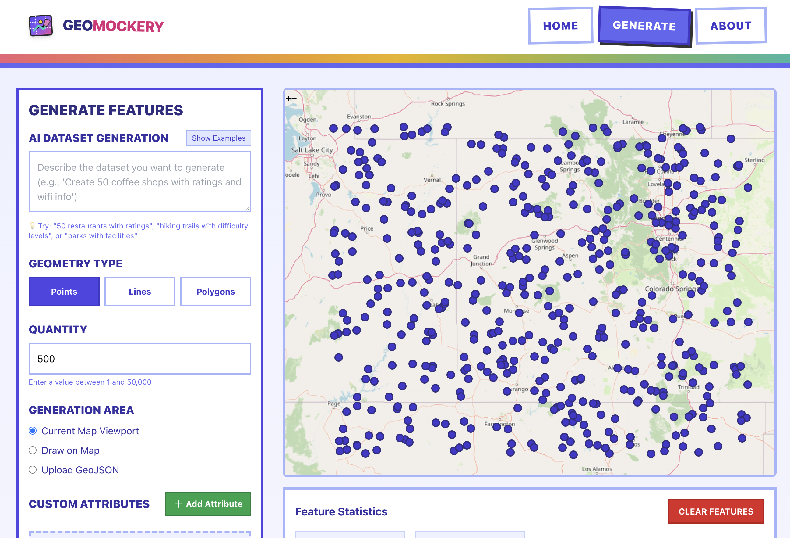

# Geomockery



**Geomockery** is a **client-side** tool for generating **synthetic** geospatial features for demos, tests, and learning. Draw or upload a boundary, pick a geometry type, generate random features inside that area, preview them on a map, and export.

There is **no server** and **no LLM**: “prompt” and attribute behavior are driven by **templates, keywords, and rule-based defaults** in the browser—not remote AI.

---

## What it does (v0.1)

- **Boundaries:** Map viewport, drawn polygon, or uploaded / URL GeoJSON.
- **Geometry:** Points, straight two-point line segments, or jittered polygons (not street routing or cadastral realism).
- **Attributes:** Configurable fields with generated values (nominal, ordinal, quantitative, etc.) using the built-in rule engine.
- **Preview:** OpenLayers map preview of generated features.
- **Export:** **GeoJSON** and **Shapefile** (ZIP via `@mapbox/shp-write`). **GeoPackage is not implemented** (the code path throws; do not rely on it).

---

## What it does *not* do (yet)

- Natural-language or cloud “AI” generation
- Network routing, street-following lines, or realistic urban clustering
- GeoPackage export
- Guaranteed reproducibility from a seed (RNG is not wired for deterministic runs)
- Automated performance proof at very large feature counts (generation is a single-threaded client loop)

See [`docs/AUDIT_REPORT.md`](docs/AUDIT_REPORT.md) for a source-grounded status table.

---

## Tech stack

- **Next.js 15** (static export), **React 19**, **TailwindCSS**
- **OpenLayers** (`ol`) for the map
- **Turf** (`@turf/turf`) for generation helpers
- **Shapefile:** `@mapbox/shp-write`

---

## Run locally

```bash
git clone https://github.com/rgdonohue/geomockery.git
cd geomockery
npm install
npm run dev
```

Open [http://localhost:3000](http://localhost:3000).

**Production build (static export):**

```bash
npm run build
```

Output is written to `out/` (see `next.config.mjs`).

---

## Deploy

GitHub Actions (`.github/workflows/deploy.yml`) builds and deploys the static `out/` directory to **GitHub Pages** on pushes to `main`. Configure the repository’s Pages source to match your workflow (e.g. `gh-pages` branch or artifact—verify in your repo settings).

---

## Project layout

```
src/
├── app/              # Next.js App Router pages (/, /generate, /about)
├── lib/
│   ├── geo/          # Generators, exporters
│   ├── ai/           # Rule-based prompt / attribute helpers (no LLM)
│   └── utils/        # Random, helpers
├── hooks/            # useExport, useAiProcessor (barrel: src/hooks/index.js)
├── components/       # layout, forms, etc.
├── config/
└── data/
```

The `src/components/ui/` directory may exist but is **empty**—there is no shared UI kit in-tree.

---

## Contributing

Issues and PRs are welcome. Please keep changes focused; this project is optimized for a **small, honest** public release.

---

## License

MIT
